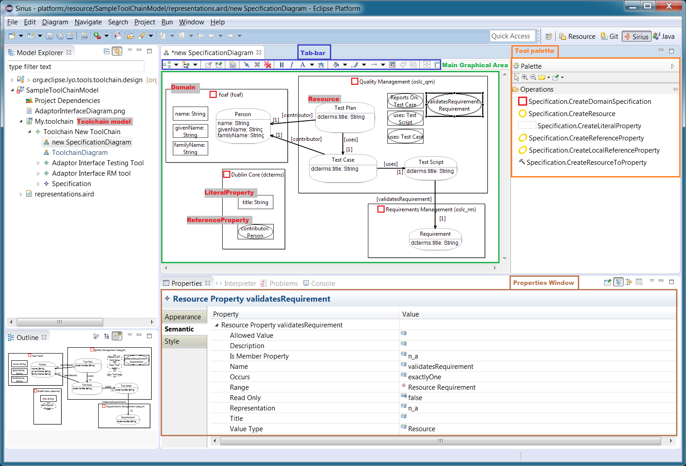

Lyo Designer is an Eclipse plugin that allows one to graphically model (1) the overall system architecture, (2) the information model of the RDF resources being shared, and (3) the individual services and operations of each Server in the system. The figure below shows the information modelling interface:

Lyo Designer includes a integrated code generator that synthesizes the model into almost-complete OSLC4J-compliant running implementation.
The resulting code includes:

* Java classes with appropriate OSLC4J-annotations to reflect the modelled RDF resource shapes
    * This automates the marshaling/unmarshaling of Java instances as Linked Data RDF resources.
* JAX-RS Service operations for accessing, updating, creating and deleting RDF resources.
    * These operations handle any of the supported formats (turtle, RDF/XML, Json, etc.)
    * For debugging purposes, JSP pages are also produced to deliver HTML representations of all RDF resources.
* JAX-RS Service operations to completely handle [Delegated UI](http://docs.oasis-open.org/oslc-core/oslc-core/v3.0/cs01/part4-delegated-dialogs/oslc-core-v3.0-cs01-part4-delegated-dialogs.html) for both creation and selection dialogs.
    * Including the initial generation of basic JSP pages for the html-representation of the dialogs.
* JAX-RS Service operations to handle [Resource Preview](http://docs.oasis-open.org/oslc-core/oslc-core/v3.0/cs01/part3-resource-preview/oslc-core-v3.0-cs01-part3-resource-preview.html)
    * Including the initial generation of basic JSP pages for the html-representation of the resource previews.

Lyo Designer supports incremental development, where manual changes to the generated code are preserved upon changes to the model, and subsequent code regeneration.

# Tutorials and Documentation

* How to [install Lyo Designer](Installing-Lyo-Designer)
* How to [use Lyo Designer](User-Manual-for-Toolchain-Modelling) to model a toolchain and generate an initial code base
* How to [use Lyo Designer](User-Manual-for-Domain-Specification-Modelling) to model domain specifications, and generate OSLC4J-annotated Java classes to reflect the defined OSLC Resources. 
* [Working with Lyo Designer from source code](Working-from-Source-Code)
